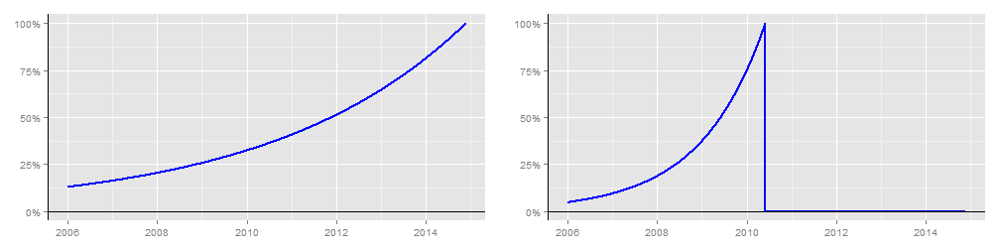

## Rankings

#### Rankings in sports are important! They're important for the public and tournament organisers:

- Teams need to be ordered in some way to produce balanced groups in competitions.
- For example, in international soccer, you don't want 2 teams qualifying for the World Cup from a group containing Spain, France, Germany, England and Italy.
- Especially if another group contains San Marino, Andorra, Gibraltar, Liechtenstein and the Faroe Islands.
- Keeping qualification or early stages of a tournament balanced make it more likely that the best teams will reach the later stages: For example, Netherlands, Brazil, Germany and Argentina reaching the semi-finals of the last World Cup.

#### They're important for the teams involved, too! 

- A good ranking can mean a kinder draw and a better chance of progressing to the later stages of a tournament.
- For example, Argentina were ranked high enough to be a top seed for the World Cup, and faced an easy group as a result (Nigeria, Bosnia and Iran).
- Meanwhile England and Italy missed out on a top seeding, and were drawn together with Uruguay (another strong team). Both crashed out at the group stage! Similarly, Netherlands and Chile were drawn together with Spain.

#### Fortunately, [FIFA have developed a ranking system](http://en.wikipedia.org/wiki/FIFA_World_Rankings), so that's probably all OK, right! 
  
  
_____
   

(Spoiler alert: No. No, it really isn't.)

---

## The Problem(s)

#### Well, the main problem can be summarised as: The ranking system is truly terrible. 

- Teams *always* decrease their ranking points if they lose. So if San Marino lose 3-2 to Brazil in extra time, the ranking system thinks "San Marino are worse than we thought", unlike every single human who's heard of football.
- There's no account of goal difference: Germany demolished Brazil 7-1 in the World Cup Semi-Final but for all the ranking system cares, it might as well have been 4-3.
- Here's a good bit of built-in bias: The amount of points you get for beating a team depends on your confederation. Not your own strength, nor that of the opposition - your confederation. So a European team (UEFA) beating Australia 3-2 earn more points than an African team do for beating them 10-0.
- Weightings are completely mishandled by Fifa and affect the maximum points you can receive, but not the minimum... so a highly ranked team could play a friendly against someone and be *guaranteed* to decrease in ranking, because the maximum points available are lower than their current average. In that situation (which happens all the time by the way), both the winning team and the losing team would decrease in ranking.
- To emphasise this: If two teams from the top 5 played each other in a friendly right now, both teams would decrease in ranking **regardless of the result**. 

#### There are plenty of other issues. It should be pretty obvious by now that such a ranking system doesn't always reward success fairly.

_____

There are alternatives, such as the [ELO](https://en.wikipedia.org/wiki/World_Football_Elo_Ratings) system, which solve some of the most egregious problems. But they still use some very arbitrary assumptions, which should bother you if you really want to know who the strongest teams are!

---

## A Solution

#### So let's approach the problem a bit more scientifically. We want a ranking system that does the following:

- Takes the evidence we have (results of previous matches) and converts them into some useful statistic.
- By useful, we mean something predictive that relates to how strong a team is. A higher ranked team should be a favourite against a lower ranked one.
- It should be fair: If a team does better than expected their ranking should rise, and vice-versa.

#### Modelling goals scored/conceded, as a poisson process, is about the simplest approach we can take to fulfil these criteria (plus it's a fairly accurate).

- Each team is modeled by two statistics, an attack value (related to the frequency they score) and a defence value (the frequency they concede). Along with two global parameters, one reflecting the overall rate of scoring and another correcting for the (considerable) advantage of playing at home.
- We find the parameters that maximise the likelihood of the data we've observed. That minimises the subjectivity of our ranking (e.g. ELO still has pretty arbitrary formulae to account for opposition strength or home advantage, whereas this model will learn them for itself).

#### Of course, smart people will always disagree on exactly how to calculate the ranking. How much importance should we attach to friendlies v competitive games? To games a week ago v those a year ago? So the Smart Soccer Ranking App not only calculates a ranking, it also lets you fine tune your own ranking.

---

## The App

The app is available [here](http://iainharlow.shinyapps.io/SoccerRanks/), fully documented, and all set up to calculate rankings for 200+ international football teams. You can make various choices before calculating the ranking. More choices are being added, but one key example is how the date of a match should affect its importance. To illustrate, two different choices of date weightings you could make with the app are shown below (R code is long so it's hidden; you can see the Rmd file [here](http://github.com/iainharlow/SoccerRanksPitch)):

On the left, we've chosen a long halflife for matches, so a game 3 years ago is worth 50% of one today. And we've included all results in the database (it currently spans from 1st Jan 2006 to 20 Nov 2014), which takes a little longer to run but is more stable/accurate. 
On the right, we've used a shorter halflife (games lose half their importance every year), but also told the model only to include matches before June 2014, giving us a picture of the strength of teams going in to the previous World Cup. We can also set the importance of friendlies, or how much attention to pay to outliers, and each time we run it the app will produce an interactive table of international teams and their strengths. Head over and give it a try!

